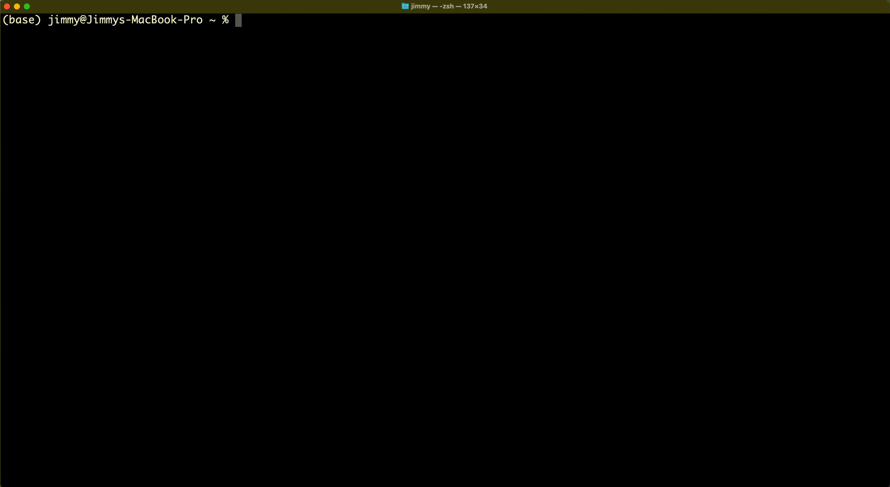

[](https://scrutinizer-ci.com/g/hermgerm29/qdbg/build-status/main)
[](https://scrutinizer-ci.com/g/hermgerm29/qdbg/?branch=main)
[](https://codecov.io/gh/hermgerm29/qdbg)


# qdbg
Quick debug tool - a general purpose CLI debugging utility

## Introduction



Eliminate the wasted clicks and keystrokes involved with copying your error messages into a search bar. `qdbg` does this tedious task for you (and we know you do it a lot :wink:). Simply run any command, and when your program inevitably fails, `qdbg` will automatically open a search tab for you.

```bash
qdbg <cmd>
```

In the unlikely event that your program runs successfully, `qdbg` will stay out of your way.


## Requirements

* A developer that runs faulty programs
* Python 3.7+
* Linux or OSX operating system
* A functioning web browser

## Dependencies

`qdbg` is implemented only using the Python3 standard library. The package does have a few developer dependencies, including [python-poetry](https://github.com/python-poetry/poetry), that are listed in `pyproject.toml`.


## Installation

### OSX / Linux (recommended)

```bash
curl -sSL https://raw.githubusercontent.com/hermgerm29/qdbg/main/get-qdbg.py | python -
```

### Windows

Not supported.

### PyPI

[qdbg](https://pypi.org/project/qdbg/) is available on PyPI, but the recommended install method is preferred.

## Credits

`qdbg`'s installation script is heavily derived from [python-poetry](https://github.com/python-poetry/poetry).
